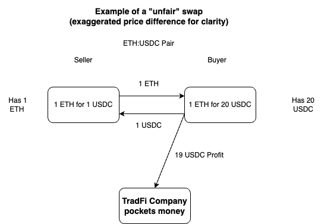
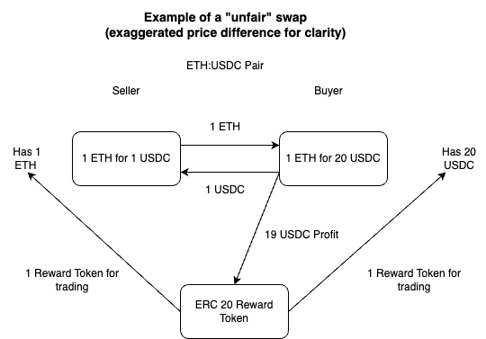
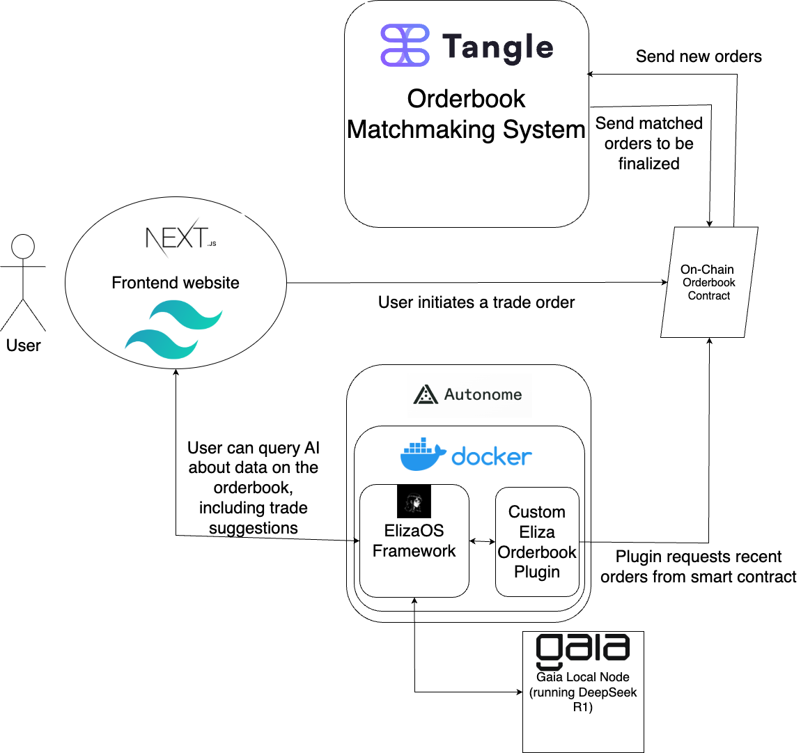

# EasyOrder

EasyOrder is a user-first orderbook matchmaking service that utilizes an AI agent to help user make the most efficient trades. 

In TradFi, companies specializing in matchmaking services will typically pocket any profits made when someone initiates a limit order that is above asking price or below bidding price. See example below:

Our orderbook places all profits into a ERC20 "Reward" token, that gets distributed to users everytime they trade on our platform. 

Besides distributing profits to users, we also provide an AI agent that actively works to make sure you make the best trade on our orderbook. The agent will query all of the most recent orders, and determine what price levels the user should trade at.

## System Architecture Overview

The user submits a trade order on the frontend NextJS web3 website () which stores the order in an on chain smart contract.

The matchmaking service runs on Tangle AVS operators, where operators watch for new orders and try to match them to existing ones. The matched orders are signed, aggregated, processed and then sent to a smart contract to be finalized on chain. 

The AI agent, using the ElizaOS framework and hosted on Autonome, queries the smart contract for the most recent trades and outstanding orders, and helps the user make the best possible trades based on that information.

A Gaia node (run locally on our machine) is used to host the DeepSeekR1 model for the AI agent.

## Repositories

[AI Agent with custom orderbook plugin](https://github.com/orderbook-avs/eliza-orderbook-plugin)

[Tangle AVS System and Orderbook Smart Contract](https://github.com/orderbook-avs/orderbook_tangle)

[Frontend Website](https://github.com/orderbook-avs/frontend)

## For Gaia
We followed the tutorial [here](https://docs.gaianet.ai/getting-started/quick-start/) to set up our own Gaia node. We used the DeepSeekR1 model, available for download [here](https://huggingface.co/datasets/gaianet/paris/resolve/main/paris_768_nomic-embed-text-v1.5-f16.snapshot)

Our `rag_prompt` and `system_prompt` were set to `You are an AI agent. Follow all instructions given.` so as to not interfere with Eliza OS's instructions.

Our Gaia node url: `https://0xa54bf247699c76f19698b10a3fe49e55997d9515.gaia.domains`
